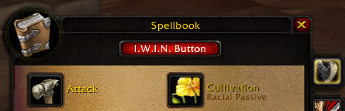
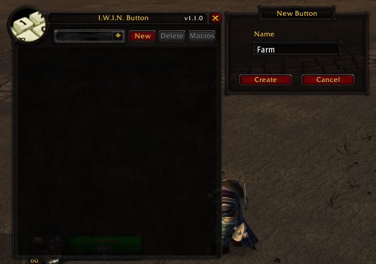
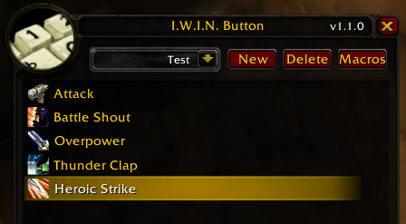
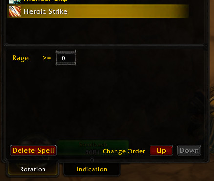
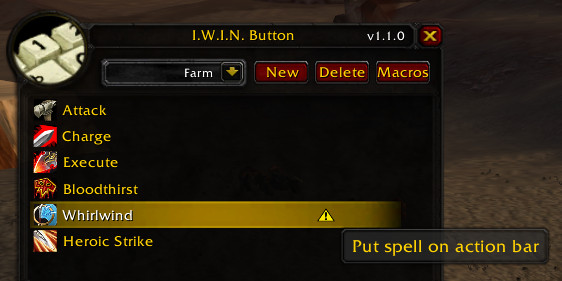

# I.W.I.N Button  
Аддон для **Turtle WoW.** 
Позволяет настроить ротацию на нажатие одной кнопки:
-   выбирайте порядок и условие применения способностей
-   вносите в настройку кнопки селф-бафы - больше не нужно следить за их наличием.
-   дебаф из ротации на цели будет обновлен, как только он спадет
-   создавайте разные ротации для дамага по одной цели, аое-дамага, фарма и т.п.

Аддон не просто применяет указанные способности в порядке очередности. 
При нажатии кнопки макроса, учитывается информация о наличии соответствующего бафа/дебафа, доступности энергии/раги/маны, возможности применения заклинания. 
При создании аддона использовались новейшие достижения в области ИИ, чтобы позволить вам наслаждаться процессом игры вместо судорожного отслеживания кулдаунов.

### Создаем первую кнопку

|#  | Действие | Скрин |
|---|---|---|
|1. | После установки аддона в SpellBook'е появится кнопка, по нажатию на которую открывается основное окно аддона.||
|2. | Для создания новой ротации, жмем **New** и вводим имя.||
|3. | Добавляем нужные заклинания из SpellBook'а кликая по ним, удерживая Ctrl+Shift.||
|4. | Настройки выбранного заклинания (если они есть) отображаются под списком.||
|5. | Важно также перетащить из SpellBook'а выбранные заклинания на панель.||
|6. | Далее жмем **Macros** и перетаскиваем его на панель. Создается макрос для текущего персонажа. При желании можно сменить иконку. ||
|7. | Готово!||

###### Предупреждение! Аддон вызывает привыкание.
